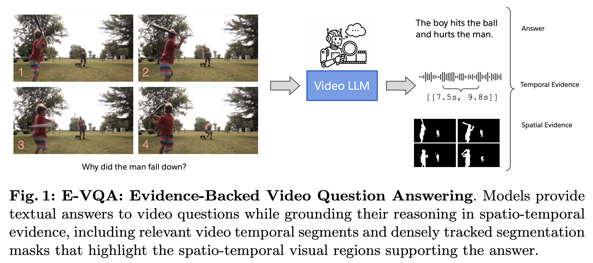
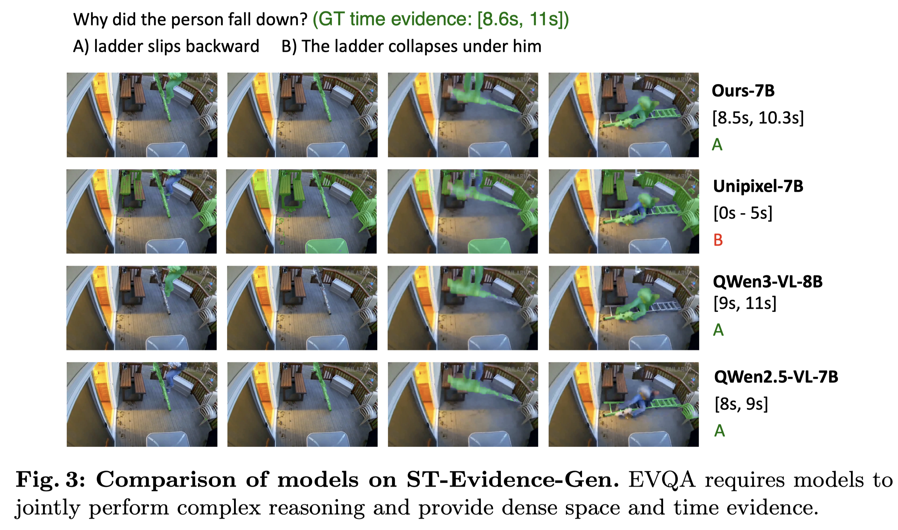

# EVQA - Evidence-Backed Video Question Answering

A unified framework for video question answering with spatio-temporal evidence generation and evaluation.

🎉 **Accepted by ECCV 2026!** 🎉

Current Video LLMs largely operate as black boxes, providing textual answers without verifiable visual grounding. To bridge the gap between semantic reasoning and visual perception, we propose Evidence-Backed Video Question Answering (**E-VQA**). This novel task requires models to jointly output a semantic answer and precise spatio-temporal evidence: temporal segments and dense, tracked object segmentation masklets.

To support this, we introduce **ST-Evidence**, the first human-verified benchmark for both discriminative and generative pixel-level grounding. Evaluations of state-of-the-art models reveal a critical decoupling between QA accuracy and true visual perception that scaling alone fails to bridge. To address this, we develop an automated generation pipeline to create **ST-Evidence-Instruct**, a 160k-scale dataset bridging high-level reasoning with fine-grained grounding. Fine-tuning grounded Video LLMs on this data yields substantial gains, establishing a robust baseline for explainable, evidence-backed video understanding.

## Overview

<div align="center">
  
</div>

**Figure 1: EVQA Task Overview.** EVQA introduces two novel benchmark tasks for evidence-backed video question answering:
- **Generative ST-Evidence Task (Main Task)**: Generate answers along with spatial (masklets) and temporal (time segments) evidence
- **Multiple-Choice ST-Evidence Task**: Select the correct answer and evidence from multiple candidates


<div align="center">
  
</div>

**Figure 2: Model Performance Comparison.** Our model achieves state-of-the-art performance by directly generating pixel-level spatial evidence along with answers and temporal evidence.

> **Note:** If the image above doesn't display, you can view it directly [here](https://raw.githubusercontent.com/SalesforceAIResearch/EVQA/main/assets/EVQA-ModelComparison.png).


## Releases & Resources
We open-sourced our resources to establish a robust baseline for explainable, evidence-backed video understanding:
- 🟢 𝐁𝐞𝐧𝐜𝐡𝐦𝐚𝐫𝐤 (𝐒𝐓-𝐄𝐯𝐢𝐝𝐞𝐧𝐜𝐞): https://huggingface.co/datasets/Salesforce/ST-Evidence-Bench
- 🟢 𝐒𝐅𝐓 𝐃𝐚𝐭𝐚𝐬𝐞𝐭 (𝐒𝐓-𝐄𝐯𝐢𝐝𝐞𝐧𝐜𝐞-𝐈𝐧𝐬𝐭𝐫𝐮𝐜𝐭): https://huggingface.co/datasets/Salesforce/ST-Evidence-Instruct
- 🟢 𝐌𝐨𝐝𝐞𝐥𝐬 (𝐒𝐓-𝐄𝐯𝐢𝐝𝐞𝐧𝐜𝐞 𝟑𝐁 & 𝟕𝐁): https://huggingface.co/Salesforce/ST-Evidence-3B & https://huggingface.co/Salesforce/ST-Evidence-7B
- 🟢 𝐂𝐨𝐝𝐞: https://github.com/SalesforceAIResearch/EVQA


## Directory Structure

```
EVQA/
├── train/                          # Training code and data
│   ├── unipixel/                   # UniPixel model implementation
│   │   ├── model/                  # Model architectures
│   │   ├── dataset/                # Dataset loaders
│   │   ├── train/                  # Training scripts
│   │   └── eval/                   # Evaluation scripts
│   ├── sam2/                       # SAM2 integration
│   ├── scripts/                    # Training scripts
│   │   ├── sft.sh                  # Main training script
│   │   ├── auto_eval.sh            # Auto evaluation script
│   │   └── zero*.json              # DeepSpeed configurations
│   ├── data/                       # Training datasets
│   ├── model_zoo/                  # Model checkpoints
│   ├── requirements.txt            # Python dependencies
│   └── setup.py                    # Package setup
│
└── benchmark/                      # Benchmark evaluation
    ├── st_evidence_gen/            # Generative ST-Evidence task
    │   ├── ours_st_evidence.py     # UniPixel inference
    │   ├── gpt_st_evidence.py      # GPT-4/5 baseline
    │   ├── gemini_st_evidence.py   # Gemini baseline
    │   ├── internvl_3_5.py         # InternVL baseline
    │   ├── qwen2_5vl_st_evidence.py # Qwen2.5-VL baseline
    │   └── eval_st_evidence.py     # Evaluation script
    │
    └── st_evidence_mcq/            # Multiple-choice ST-Evidence task
        ├── ours_st_evidence_mcq.py # UniPixel inference
        ├── gpt_st_evidence_mcq.py  # GPT baseline
        ├── gemini_st_evidence_mcq.py # Gemini baseline
        └── eval_st_evidence_mcq.py # Evaluation script
```

## Setup

### 1. Install Dependencies

```bash
cd train
pip install -r requirements.txt

# Install PyTorch (if not already installed)
pip install torch==2.7.1+cu128 torchvision==0.22.1+cu128 --extra-index-url https://download.pytorch.org/whl/cu128

# Install Flash Attention (optional, for faster training)
pip install flash-attn==2.8.2
```

## Training Data

### Data Structure

The training data is organized in `train/data/` with the following structure:

```
train/data/
├── st-evidence-instruct/        # ST-Evidence instruction tuning data
│   ├── gen_mask/                # Mask generation task
│   │   ├── st_evidence.csv      # Metadata and annotations
│   │   ├── masks/               # Object masks (JSON format)
│   │   ├── video_frames_6fps/   # Extracted video frames at 6fps
│   │   └── st_evidence_meta.pkl # Additional metadata
│   └── gen_qa/vicas/            # QA generation task (141k samples)
│       └── st_evidence_vicas.csv
├── revos/                       # Referring expression video segmentation
├── mevis/                       # Multi-expression video segmentation
├── lvvis/                       # Long video instance segmentation
├── ref_youtube_vos/             # Referring YouTube-VOS
├── ref_davis17/                 # Referring DAVIS-17
├── ref_sav/                     # Referring SAV
├── groundmore/                  # Grounding dataset
├── vicas/                       # Video caption segmentation
│   ├── annotations/
│   ├── splits/
│   ├── masks/                   # Segmentation masks
│   └── video_frames/            # Video frames
├── llava_instruct/              # LLaVA instruction data
└── videogpt_plus/               # VideoGPT+ data
```

### Data Format Examples

**ST-Evidence CSV Format** (`st_evidence_vicas.csv`):
```csv
entry_id,video_id,video_path,question,answer,candidates,mask_evidence,source,split,qa_source,temporal_evidence
10375_0,10375,010375_video.mp4,What object is the man holding?,A pole,"['A desk', 'A book', 'A chair', 'A pole']","[1, 2]",vicas,train,gemini,"[[0.0, 14.5]]"
```

**Mask Annotation JSON Format** (`masks/YNIWQ_868759.json`):
```json
{
  "entry_id": "YNIWQ_868759",
  "video_path": "videos/star/YNIWQ.mp4",
  "fps": 6.0,
  "width": 480,
  "height": 270,
  "evidence_objects": [
    {
      "ref_expression": "gray backpack on the bed",
      "prompts": [
        {
          "timestamp": 0.0,
          "bbox_norm": [385.0, 420.0, 740.0, 997.0],
          "frame": 0,
          "confidence": 0.95
        }
      ]
    }
  ]
}
```

### Download Datasets

**ST-Evidence-Instruct Dataset** (~46GB):
```bash
# Download from HuggingFace
huggingface-cli download Salesforce/ST-Evidence-Instruct --repo-type dataset --local-dir train/data/st-evidence-instruct

# Extract compressed files
cd train/data/st-evidence-instruct/gen_mask
tar -xzf masks.tar.gz
tar -xzf video_frames_6fps.tar.gz
```

Download link: https://huggingface.co/datasets/Salesforce/ST-Evidence-Instruct

**Other Training Datasets** (ReVOS, MEVIS, LVVIS, etc.):
```bash
# Download UniPixel-SFT-1M dataset bundle
huggingface-cli download PolyU-ChenLab/UniPixel-SFT-1M --repo-type dataset --local-dir train/data/
```

Download link: https://huggingface.co/datasets/PolyU-ChenLab/UniPixel-SFT-1M

## Training

### Basic Training Command

```bash
cd train
bash scripts/sft.sh [model_size] [sam2_type] [resume_option]
```

**Parameters:**
- `model_size`: `3b` or `7b` (default: `3b`)
- `sam2_type`: `base` or `large` (default: `base`)
- `resume_option`:
  - `--from_scratch` - Train from scratch
  - `/path/to/checkpoint` - Resume from specific checkpoint
  - (empty) - Auto-resume if checkpoint exists

### Examples

```bash
# Train UniPixel-3B with SAM2-Base from scratch
bash scripts/sft.sh 3b base --from_scratch

# Train UniPixel-7B with SAM2-Large (auto-resume)
bash scripts/sft.sh 7b large

# Resume from specific checkpoint
bash scripts/sft.sh 3b base /path/to/checkpoint/dir
```

### Training Configuration

The training script supports various datasets and configurations:
- **Datasets**: ST-Evidence, ReVOS, MEVIS, LVVIS, Ref-YouTube-VOS, Ref-DAVIS, etc.
- **LoRA**: Enabled with r=128, alpha=256
- **Learning Rate**: 2e-5 (SAM2: 5e-6)
- **Batch Size**: 4 per device with 8 GPUs
- **Max Frames**: 8 random sampled frames per video

Training logs and checkpoints will be saved to `train/work_dirs/{model_size}/finetune_1e_sam2_{type}_videoseg_eccv_merged_v2/`

## Benchmark Evaluation

### ST-Evidence Generation Task

Generate answers and spatio-temporal evidence for video questions.

#### Grounded MLLMs (Direct Mask Generation)

These models can directly generate segmentation masks for spatial evidence.

**UniPixel:**
```bash
cd benchmark/st_evidence_gen

# Single GPU
CUDA_VISIBLE_DEVICES=0 python unipixel_st_evidence.py \
    --fps 1.0 \
    --model PolyU-ChenLab/UniPixel-3B

# Multi-GPU (8 GPUs)
bash ours_st_evidence_multigpu.sh /path/to/trained/model 8 0
```

**SA2VA:**
```bash
CUDA_VISIBLE_DEVICES=0 python sa2va_st_evidence.py --device cuda
```

#### General MLLMs (2-Step Process)

These models generate referring expressions first, then use UniPixel to generate masks.

**Step 1: Generate Answers and Referring Expressions**

```bash
cd benchmark/st_evidence_gen

# GPT
python gpt_st_evidence.py --model o3 --mode single-turn --fps 1

# Gemini
python gemini_st_evidence.py --model gemini-2.5-flash --mode single-turn
python gemini_st_evidence.py --model gemini-2.5-pro --mode single-turn

# InternVL 3.5
CUDA_VISIBLE_DEVICES=0 python internvl_3_5.py --mode single-turn

# Qwen2.5-VL
CUDA_VISIBLE_DEVICES=0 python qwen2_5vl_st_evidence.py \
    --model Qwen/Qwen2.5-VL-7B-Instruct \
    --fps 1 \
    --mode single-turn

# Qwen2.5-VL-72B (multi-GPU)
CUDA_VISIBLE_DEVICES=0,1,2,3 python qwen2_5vl_st_evidence.py \
    --model Qwen/Qwen2.5-VL-72B-Instruct \
    --fps 1 \
    --gpu-num 4

# Qwen3-VL
CUDA_VISIBLE_DEVICES=0 python qwen3vl_st_evidence.py \
    --model Qwen/Qwen3-VL-4B-Instruct \
    --fps 1 \
    --batch-size 8 \
    --gpu-num 1 \
    --mode single-turn

# VideoLLaMA3
CUDA_VISIBLE_DEVICES=0 python videollama3_st_evidence.py \
    --model DAMO-NLP-SG/VideoLLaMA3-3B \
    --mode single-turn \
    --fps 1 \
    --max-frames 128

# LLaVA-OV-1.5
CUDA_VISIBLE_DEVICES=0 python llava_ov1_5_st_evidence.py \
    --mode single-turn \
    --max-size 512
```

**Step 2: Generate Masks from Referring Expressions**

```bash
python unipixel_video_seg.py \
    results/qwen3vl/qwen3_vl_235b_a22b_instruct_st_evidence_ref_exp_1fps.json \
    --save_masks \
    --skip_viz \
    --mode seperate \
    --batch_size 5 \
    --every_n_frames 6
```

#### Evaluation

```bash
# Evaluate QA and temporal evidence only
python eval_st_evidence.py --pred_file results/ours/predictions.json

# Evaluate with mask quality metrics (J, F, J&F scores)
python eval_st_evidence.py \
    --pred_file results/gemini/gemini_2_5_flash_st_evidence_single_1fps.json \
    --eval_masks \
    --pred_mask_dir results/gemini/gemini_2_5_flash_st_evidence_single_1fps/concat \
    --num_workers 32
```

**Metrics:**
- **QA Accuracy**: Percentage of correct answers
- **Temporal IoU/IoP**: mIoU, TIoU@0.3, TIoU@0.5, mIoP, TIoP@0.3, TIoP@0.5
- **Mask Quality** (optional): J score (region IoU), F score (contour accuracy), J&F score

### ST-Evidence MCQ Task

Multiple-choice evaluation for QA, temporal evidence, and spatial evidence selection.

#### Using UniPixel

```bash
cd benchmark/st_evidence_mcq

# Run single task
python ours_st_evidence_mcq.py --task qa --model /path/to/model

# Run all tasks (QA + temporal + spatial)
python ours_st_evidence_mcq.py --task all --model /path/to/model
```

**Tasks:**
- `qa`: Video question answering (5 options: A/B/C/D/E)
- `time_evidence`: Select best temporal segment (4 options: A/B/C/D)
- `spatial_evidence`: Select best masked region (4 options: A/B/C/D)
- `all`: Run all three tasks sequentially

#### Using Baseline Models

```bash
# GPT
python gpt_st_evidence_mcq.py --task all --model o3 

# Gemini
python gemini_st_evidence_mcq.py --fps 1 --task all --model gemini-2.5-pro

# Qwen2.5-VL
CUDA_VISIBLE_DEVICES=0,1,2,3 python qwen2_5vl_st_evidence_mcq.py --task all --model Qwen/Qwen2.5-VL-72B-Instruct --batch_size 8 --gpu_num 4

# Qwen3-VL
CUDA_VISIBLE_DEVICES=0 python qwen3vl_st_evidence_mcq.py --task all --model Qwen/Qwen3-VL-4B-Instruct --batch_size 8 --gpu_num 1
```

#### Evaluation

```bash
python eval_st_evidence_mcq.py --pred_file results/ours/predictions_all.json
```

**Output:**
- QA Accuracy
- Temporal Evidence Accuracy
- Spatial Evidence Accuracy

## Output Format

### Generation Task Output
```json
{
  "entry_id": {
    "answer": "answer text",
    "gt_answer": "ground truth",
    "time_segments": [[0.5, 2.3], [5.1, 7.8]],
    "gt_time_segments": [[0.6, 2.5], [5.0, 8.0]],
    "referring_expressions": ["person on the left", "red car"],
    "mask_dir": "path/to/masks"
  }
}
```

### MCQ Task Output
```json
{
  "entry_id": {
    "answer": "A",
    "gt_answer": "B",
    "evidence_t": "C",
    "gt_evidence_t": "A",
    "evidence_s": "D",
    "gt_evidence_s": "D"
  }
}
```

## License

CC-BY-NC 4.0


This was released for research purposes only, in support of the academic paper *Evidence-Backed Video Question Answering*.

## Contact

For questions or inquiries, please reach out to Shijie Wang: [wang98thu@gmail.com](mailto:wang98thu@gmail.com)


## Citation

If you find this work useful for your research, please cite our paper:

```bibtex
@inproceedings{wang2026evidence,
  title={Evidence-Backed Video Question Answering},
  author={Wang, Shijie and Zhou, Honglu and Wang, Ziyang and Xu, Ran and Xiong, Caiming and Savarese, Silvio and Sun, Chen and Niebles, Juan Carlos},
  booktitle={European Conference on Computer Vision (ECCV)},
  year={2026}
}
```

